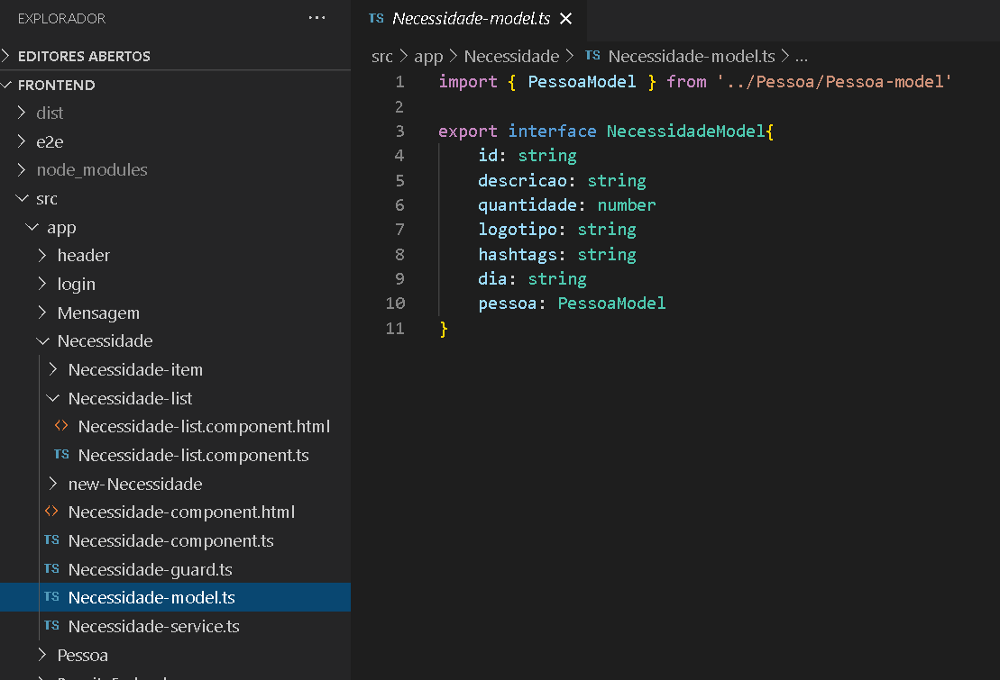
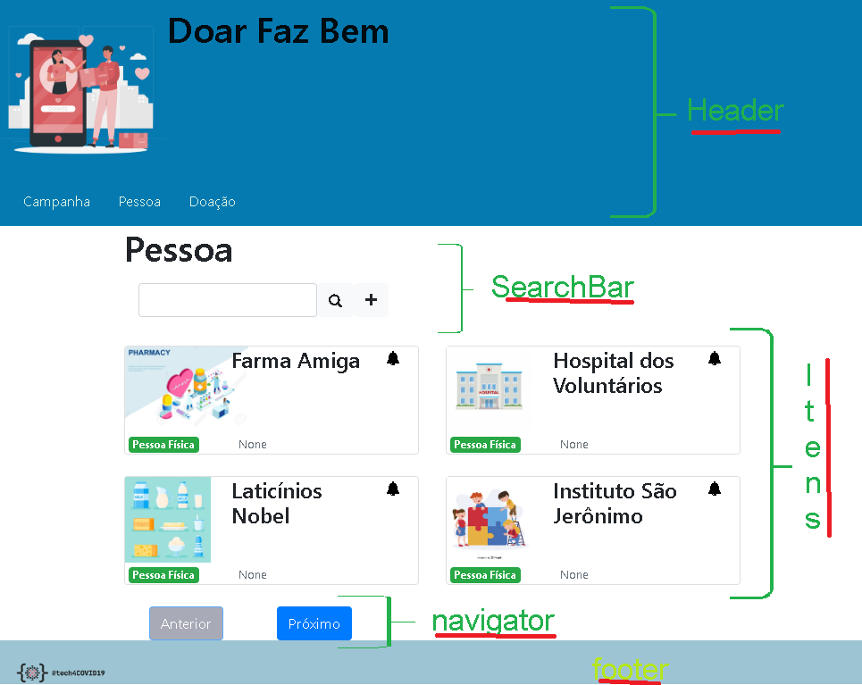
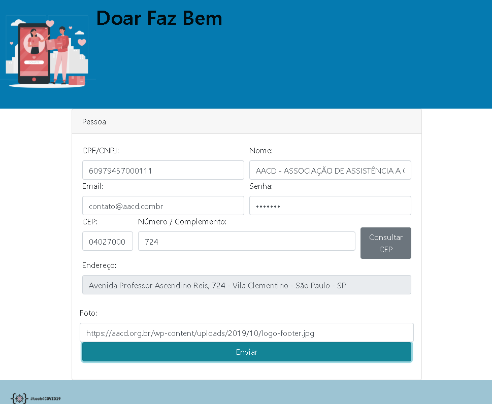

# Doar Bem
## Manual técnio do site

> O site **Doar Bem** foi feito em _Angular_, portanto o ambiente de desenvolvimento precisa dos seguintes comandos:
1)  Instalar o Angular CLI
    - `npm install -g @angular/cli`
2) Instalar o YARN 
    - https://classic.yarnpkg.com/pt-BR/docs/cli/install/
3) Atualizar os pacotes do _Doar Bem_:
    - digite `YARN` na linha de comando
4) Rodar a versão local do site:
    - `ng serve --open --proxy-config proxy.conf.json`

##### `ATENÇÃO`: Os comandos de 1 a 3 são usado somente _na primeira vez_ para instalar as ferramentas, nas próximas vezes utilize apenas o comando 4.

> Caso queira rodar também o back-end, rode os comandos abaixo:
1) Instalar o Python
    - `https://www.python.org/downloads/`
2) Baixar os fontes do back-end **(numa pasta separada)**:
    - `git clone https://github.com/jcezarc/doar_faz_bem.git`
3) Atualizar os pacotes do back-end:
    - `pip install -r requirements.txt`
4) Rodar o back-end:
    - configure a variável de ambiente `DOAR_FAZ_BEM_HOST = temp` no seu sistema operacional
    - `python app.py`

##### `ATENÇÃO`: Os comandos de 1 a 3 são usado somente _na primeira vez_ para instalar as ferramentas, nas próximas vezes utilize apenas o comando 4.

---
### Login - Como funciona
`(src/app/login...)`
- A pessoa entra com email e senha
    > O serviço _Pessoa-service_ `(src/app/Pessoa)` acessa o back-end para consultar por email e senha.
- ...Ou a pessoa clica em **Registre-se**
    > Nesse caso, há um redirecionamento para a página _/New-Pessoa_

---

### Lista de campanhas / doações
`(src/app/Necessidade/Necessidade-list)`
- O componente **NecessidadeListComponent** usa o serviço em _Necessidade-service_ para mostrar todos os itens de Necessidade (campanhas e doações)
    - Uma campanha é uma necessidade gravada com quantidade **negativa**.
    - Uma doação é uma necessidade gravada com quantidade **positiva**.
- Cada _Necessidade-item_ representa um registro na tabela de necessidades.
- Os componentes de lista -- como **Necessidade-list** -- possuem uma barra de pesquisa, além de um botão para adicionar (+) umna nova necessidade.
    - Ao clicar em adicionar, há um redirecionamento para _/New-Necessidade_
    - O retorno de _/New-Necessidade_ passa pela função `save(item)` de NecessidadeListComponent, onde **item** é um objeto do tipo _Necessidade-model_ com os dados vindos do formulário
    

---

### Navegando em Pessoas
A página _Pessoa-list_ é formada de....

- Header (com os links para as páginas do site)
- PessoaListComponent
    - Search-Bar `(src/app/shared/search-bar)`
    - Itens `(src/app/Pessoa/Pessoa-item)`
    - navigator `(src/app/shared/navigator)`
- Footer

---

### Incluindo nova Pessoa
O formulário abaixo possui os seguintes campos...

- CPF/CNPJ: Ao preencher este campo com 14 dígitos é feita uma consulta na Receita Federal, para preenchimento automático dos campos:
    - Nome
    - Email
    - CEP
- Email: Campo que não pode ser duplicado pois é usado no **login**;
- CEP e Número: Ao clicar em "Consultar CEP", o campo Endereço é preenchido com os dados de consulta aos Correios
- Foto: Caminho para a imagem que ficará associada à Pessoa.

---
